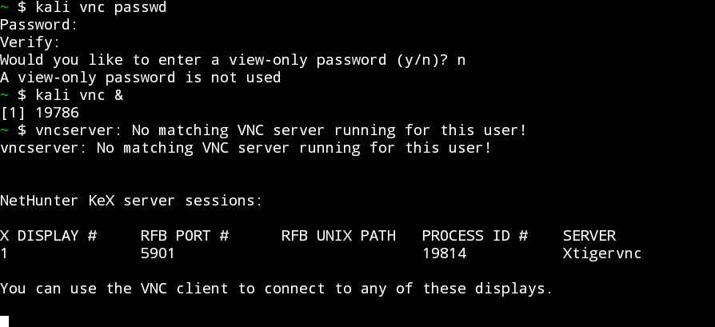
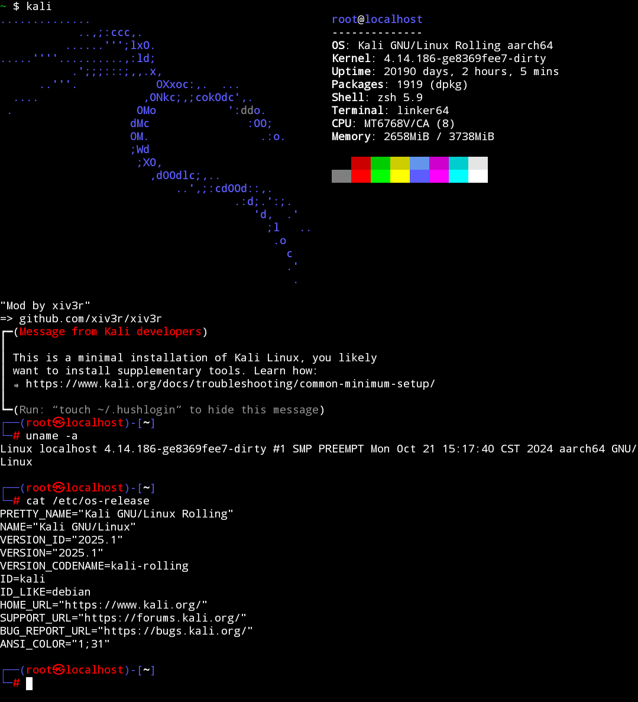

<h1 align="center">🚀 TermuxHunter</h1>
<h3 align="center">💻 Run Kali NetHunter (GUI + CLI) in Termux on Android — No Root Required!</h3>

<p align="center">
  
</p>

---

## 🧠 About

**TermuxHunter** is a mobile pentesting framework that brings **Kali Linux NetHunter** to your Android device through **Termux**. No root access is required — just a few commands to unlock both **CLI** and **GUI via VNC** access.

Whether you're an ethical hacker, CTF player, or cybersecurity student, this project gives you a lightweight, fully featured, on-the-go Kali setup — with bash/zsh customizations and fixes for Android’s background-killing behavior.

---

## 🔍 Features

- ✅ Rootless Kali NetHunter installation
- ✅ Choose between **Minimal CLI** or **Full GUI (VNC)**
- ✅ Shell enhancements using bash/zsh
- ✅ Easy user/root switching
- ✅ Phantom Process Killer fix via ADB
- ✅ Clean uninstall support

---

## 🧰 Requirements

- 📱 Android device (ARM64 architecture)
- 💾 15GB free internal storage
- 📦 [Termux v0.118.2 (GitHub build)](https://github.com/termux/termux-app/releases/download/v0.118.2/termux-app_v0.118.2+github-debug_arm64-v8a.apk)
- 🖥️ [VNC Viewer App (KeX)](https://store.nethunter.com/repo/com.offsec.nethunter.kex_11525001.apk)

---

## ⚙️ Quick Install

### 🔸 Full Kali NetHunter + GUI (Recommended)

```bash
pkg update && pkg install wget -y
wget -qO- https://raw.githubusercontent.com/KIRAN-KUMAR-K3/TermuxHunter/main/kali-full | bash && kali
````

### 🔹 Minimal Kali NetHunter (CLI only)

```bash
pkg update && pkg install wget -y
wget -qO- https://raw.githubusercontent.com/KIRAN-KUMAR-K3/DistroLab-Termux/main/KaliLinux/Chroot/kali-minimal | bash && kali
```

---

## 🖥️ Setting Up VNC GUI

1. **Set your VNC password**:

   ```bash
   kali vnc passwd
   ```

2. **Start the VNC server**:

   ```bash
   kali vnc &
   ```

3. **Open your VNC Viewer app** and connect to:

   ```
   127.0.0.1:5901
   ```

   **Username:** `kali`
   **Password:** *(Use what you set in step 1. You can also use `kali` for simplicity)*

> 📌 **Tip:** You must keep Termux running in the background while using VNC.

<p align="center">
  
</p>

---

## 🧑‍💻 User Management

| Action         | Command          |
| -------------- | ---------------- |
| Login (User)   | `kali`           |
| Login (Root)   | `kali -r`        |
| Exit           | `exit`           |
| Uninstall Kali | `kali-uninstall` |

---

## 🧬 Fix: Phantom Process Killer (Optional)

On some Android devices, background processes like VNC may be force-stopped. Here’s how to fix that:

### 🔧 What You Need

* [Shizuku](https://github.com/RikkaApps/Shizuku/releases)
* [aShell](https://github.com/DP-Hridayan/aShellYou/releases)
* Developer Options → **Enable Wireless Debugging**

### 🛠️ Run These ADB Commands (via aShell):

```bash
adb shell /system/bin/device_config set_sync_disabled_for_tests persistent
adb shell /system/bin/device_config put activity_manager max_phantom_processes 2147483647
adb shell settings put global settings_enable_monitor_phantom_procs false
```

### ✅ Verify the Fix:

```bash
adb shell /system/bin/device_config get activity_manager max_phantom_processes
adb shell dumpsys activity settings | grep max_phantom_processes
```

> 🛑 **Common Issue:**
> If you see: `Process completed (signal 9) - press Enter`, it means the phantom process killer is active. Apply the fix above.

---

## 📂 Project Structure

```bash
TermuxHunter/
├── README.md
├── images/
│   ├── kalinh.png
│   ├── kalivnc.jpg
│   └── vncsetup.png
├── kali
├── kali-full
├── neofetch
├── rcfiles/
│   ├── etcbash.bashrc
│   ├── home.bashrc
│   ├── home.zshrc
│   ├── homebash.bashrc
│   ├── root.zshrc
│   └── rootbash.bashrc
└── vnc
```

---

## 🖼️ Terminal Preview

> Password Prompt Example: `kali`

<p align="center">
  
</p>

---

## 👨‍💻 Author

**Kiran Kumar K**
Cybersecurity Enthusiast | VAPT | Bug Bounty Hunter
📧 [18kirankumar.k03@gmail.com](mailto:18kirankumar.k03@gmail.com)
🔗 [GitHub](https://github.com/KIRAN-KUMAR-K3) • [LinkedIn](https://www.linkedin.com/in/kiran-kumar-k3/) • [Blog](https://kirankumark3.blogspot.com/)

---

## 📜 License

Released under the [MIT License](/LICENSE).

---

> 🚨 **Disclaimer:** This project is for educational and ethical hacking purposes only. Do **not** use it on unauthorized systems. You are responsible for your actions.
